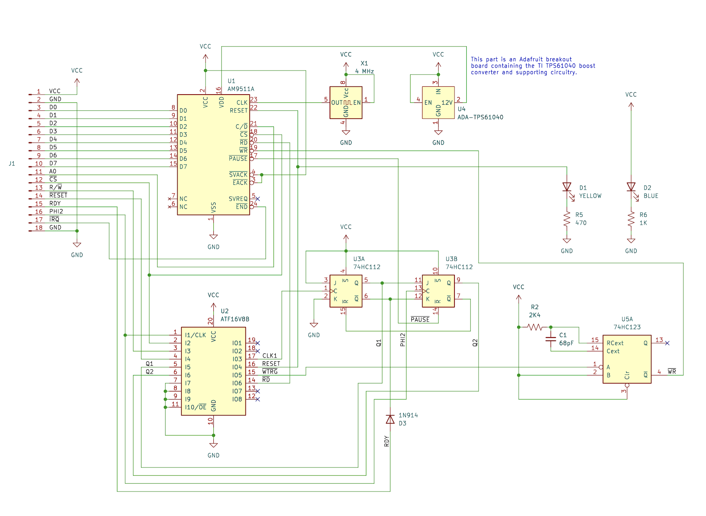

AM9511 Interface Module for the 6502
====================================

The AMD AM9511 Arithmetic Processing Unit, first produced in the late 
1970s, provides hardware support for high performance fixed and floating 
point arithmetic and a variety of floating point trigonometric and 
mathematical operations, for use with microprocessors of that period.

This repository provides schematics and board design for a module that
can be connected to the 6502 bus interface, allowing the AM9511 to be 
addressed as an I/O device. The design is adapted from the work of 
Kissel and Currie[1] in which they developed an experiment using a 6502 
microprocessor to control four AM9511A floating-point arithmetic units, 
and from Hart’s MICROCRUNCH[2] which also used the AM9511A (Intel 8231A) 
interfaced with a (Rockwell) 6502.

The specification here anticipates the use of an AM9511A clocked at
4 MHz. However, the same design will work with earlier versions of the 
AM9511, by swapping the 4 MHz clock oscillator with a unit of an 
appropriately lower speed.

See [am9511-6502-description.pdf](am9511-6502-description.pdf) for a
full description of the interface circuit design and 
[am9511-6502-schematic.pdf](am9511-6502-schematic.pdf) for the schematic.

This repository contains the full KiCad sources for the schematic and a 
PCB design for the module. 

The `logic` folder contains the programming details for the ATF16V8B
used in the circuit, as produced by [Galette](https://github.com/simon-frankau/galette) from the `am9511-6502.pld` source file. The provided JEDEC file
(`am9511-6502.jed`) can be easily programmed into an ATF16V8B using 
[minipro](https://gitlab.com/DavidGriffith/minipro).

Also included in the `docs` folder are source documents cited below, as 
well as datasheets and supplementary documents for the AM9511.

---
1. Kissel, R and Currie, J: "Hardware Math for the 6502 Microprocessor"; 
   July 1985; NASA TM-86517
2. Hart, J: "MICROCRUNCH: An Ultra-Fast Arithmetic Computing System 
   (part 1)"; August 1981; MICRO - the 6502/6809 Journal (No. 39)
